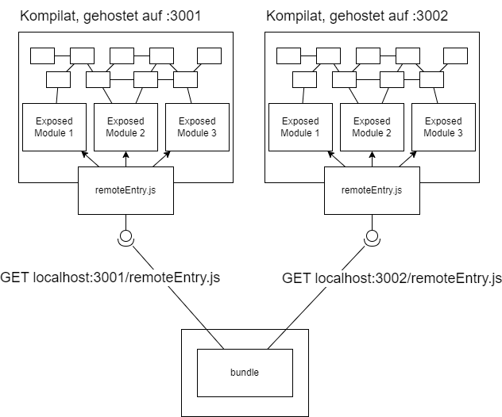
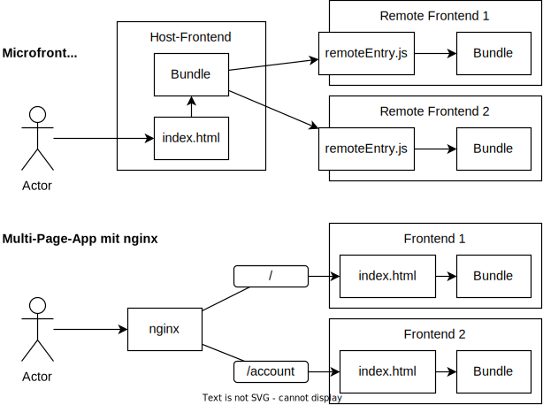
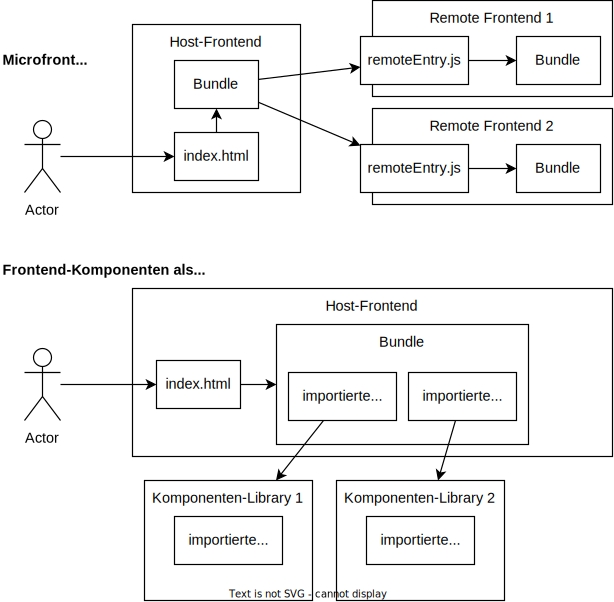

# Microfrontends für Angular und React

In der Angular- und React-Welt ist es üblich, Frontends als Single-Page-Application aufzubauen. 
Dabei gibt es ein inhaltlich leeres HTML-Dokument, welches mithilfe von im Browser laufenden Javascript mit Inhalt befüllt wird (client-side Rendering).

Alle Komponenten der Webseite werden dabei in ein großes Bundle transpiliert. Wir haben es also mit einem Monolithen zu tun. Das HTML-Dokument referenziert einen Einstiegspunkt, von welchem aus das Framework, sowie die benötigten Komponenten importiert werden.

Wie bei monolithen Backends hat das den Vorteil einer single source-of-truth, aber auch den Nachteil, dass die ganze Anwendung an einer Stelle definiert ist. Man kann zwar Komponenten in Bibliotheken auslagern welche von der Anwendung importiert werden; der Build wird aber dennoch zentral durchgeführt.

Dies ist für kleine Frontends in Ordnung, kann aber zu Konflikten bei größeren, von mehreren Teams entwickelten, Frontends führen.  
In diesem Artikel wurde sich eine potentielle Lösung, das "Microfrontend", anhand einer minimalen React- und Angular-Anwendung angeschaut.

  
*Eine Visualisierung eines Monolithen-Frontends. Das HTML-Dokument importiert beim Start Logik aus dem Bundle.*

## Microfrontends?

Microfrontends? Was genau soll man sich darunter vorstellen?

In der Backend-Welt gibt es das Konzept von "Microservices".
Bei Microservices werden die Funktionalitäten in viele kleine Backends aufgeteilt. Diese Backends können untereinander über bspw. REST oder gRPC kommunizieren, können aber unabhängig von einander Entwickelt und Deployed werden.

Dieser Ansatz verspricht gegenüber dem klassischen Monolithen geringere Komplexität in der Implementation und beim Deployen. // TODO: evtl erweitern

Microfrontends versuchen dieses Konzept in die Frontend-Welt zu übertragen. Die Idee dabei ist es, eine Haupt-Anwendung zu definieren, welche sich Teile des Frontends von anderen Servers lädt und in die Haupt-Anwendung einbindet.

Das hierfür verwendete Konzept nennt sich "Module Federation", welches laut [Webpack Dokumentation](https://webpack.js.org/concepts/module-federation/) eine Anwendung beschreibt, welche aus mehreren Kompilaten besteht bei denen die einzelnen Bundles Funktionalitäten für andere Bundles bereitstellen, bzw. von anderen Bundles konsumieren können.

Dies passiert über eine `remoteEntry.js`, welche von einem remote Module bereitgestellt wird.
  
Die `remoteEntry.js` zeigt einem Konsumenten, wo es im remote Bundle die "öffentlichen" JS-Module finden kann.

### Modulauflösung

Module Federation verwendet standardmäßig ES Module (ESM) für das Laden von externen Modulen. ESM wird [in allen gängigen Browsern unterstützt](https://caniuse.com/?search=ESM) und ist seit einigen Jahren das bevorzugten Modulsystem im Javascript-Ökosystem.

Mit ESM können Module weitere Module über zwei Arten einbinden; über einen top-level Import, sowie über den Aufruf der `import(...)` Funktion:

```ts
import { something } from '../some/module.js';
//      ^- sofort verfügbar

const { somethingElse } = await import('../another/module.js');
//                      ^- der Aufruf ist eine Promise
// es wird gewartet bis das Modul, sowie alle
//  top-level-Abhängigkeiten des Moduls, geladen wurden.
```


Module Federation verwendet die `import()` Funktion, um das remote Kompilat zu laden. Denn `import()` kann neben relativen Pfaden (`../module.js`) auch URLs (`http://localhost:3001/module.js`) aufrufen. Diese URLs können auch auf andere Server zeigen, solange der remote Server CORS-Header setzt.

Über `import()` können jedoch die remote Module nicht direkt aufgerufen werden, da Bundler wie Webpack und Rollup (Vite) die JS-Module umverpacken und für Browser optimieren.  
Statt einem `import("../util/myModule.js")` findet sich bei Webpack im Bundle ein minifizierter Aufruf von `__webpack_require__(module_id)`. Die ID ist dabei intern, kann also nicht "öffentlich" Konsumiert werden. 

Die `remoteEntry.js` ist hier die Lösung. Sie stellt eine Art Nachschlagwerk bereit. Externe Module importieren die `remoteEntry.js` und rufen das interne Modul über den Namen auf.  
Hier ist ein Ausschnitt der nicht minifizierten `remoteEntry.js`:

```js
var moduleMap = {
	"./RemoteRoute": () => {
		return __webpack_require__.e(44).then(() => (() => ((__webpack_require__(2044)))));
	}
};

/// ... der Rest der remoteEntry.js
```


## Frontends

Für diesen Blogeintrag habe ich mir 2 Frontend-Frameworks angeschaut, React und Angular.

Mit den Frameworks wurde jeweils eine kleine Anwendung implementiert, welche das Konzept der Microfrontends erprobt.
Die Anforderung an die Applikationen war es, eine Komponente, bzw. ein Modul von einem anderen Server zu laden und erfolgreich in die Applikation einzubinden, und Daten zwischen den lokalen und "remote" Komponenten zu übertragen.

### React

Das React-Frontend verwendet als Build-Tool _Vite_, ein relativ neues Entwicklungswerkzeug welches viel Wert auf Entwicklererfahrung setzt und bspw. über die Verwendung von ESM und dem Überspringen eines Bundle-Steps erheblich schnellere Bauzeiten (vor allem während der Entwicklung) ermöglicht als es bei bspw. Webpack der fall ist.

Für Vite gibt es das `vite-plugin-federation`-Modul, welches als Plugin in die Vite-Konfiguration eingebunden werden kann.

Über das Plugin lassen sich von diesem Kompilat bereitgestellte, sowie von externen Kompilaten konsumierte JS-Module deklarieren.

```ts
// vite.config.ts
import federation from "@originjs/vite-plugin-federation"

return defineConfig({
  ...
  plugins: [
    ...,
    federation({
      name: "my-component-name",
      // Der Remote Entrypoint. Ein externes Modul kann diese Datei aufrufen
      // und über einen Lookup eine der unter exposes definierten Komponenten
      // laden.
      filename: "remoteEntry.js",
      // Exposes, wenn dieses Modul Komponenten bereitstellt
      exposes: {
        "./SomeComponent": "./src/components/SomeComponent",
        "./AnotherComponent": "./src/components/AnotherComponent",
      },
      // Remotes, wenn dieses Modul externe Komponenten konsumiert,
      // mit einem Link zum Remote-Entrypoint.
      remotes: {
        someRemoteEntry: "http://localhost:5001/assets/remoteEntry.js"
      },
      // Hier definierte Dependencies werden im Browser effektiv
      // nur einmal geladen. Es muss also nicht pro Remote Frontend
      // eine eigene React-Version geladen werden.
      shared: [
        "react", "react-dom"
      ]
    })
  ]
})
```

Bei einem Build sorgt das Plugin dann dafür, dass die `remoteEntry.js`-Datei erzeugt wird.
Die Komponenten können dann über den im `remotes`-Objekt definierten Namen eingebunden werden:

```jsx
const RemoteComponent = React.lazy(() => import('someRemoteEntry/SomeRemoteComponent'));

return (
  <Suspense fallback={<Loading />}>
    <RemoteComponent />
  </Suspense>
);
```

Das Plugin schreibt dann den Import während des Builds so um, dass stattdessen hier die `remoteEntry.js` vom remote Server importiert, und darüber die gewünschte Komponente gefunden wird.

Hier ist wichtig anzumerken, dass ein top-level Import, also `import RemoteComponent from 'someRemoteEntry/SomeRemoteComponent';` *nicht* möglich ist, da es sich hier um eine synchrone Operation handeln würde. Da das remote Modul zuerst von einem anderen Server geladen werden muss ergibt das wenig Sinn.

Somit muss die `import(...)` Funktion hier verwendet werden. Sie gibt das Modul als Promise zurück.

### Angular

Das Angular-Projekt verwendet _Webpack_ als Build-Tool und das `@angular-architects/module-federation-plugin` Modul zum Aufrufen und Bereitstellen von Remote Modulen.

Ähnlich wie beim `vite-plugin-federation` kann ein Modul über die `webpack.config.js` über `remotes` und `exposes` remote Module konsumieren, bzw. Module für andere remote Module bereitstellen.

```js
module.exports = withModuleFederationPlugin({
  // Wird von diesem Kompilat konsumiert
  remotes: {
    'angular-remote': 'http://localhost:3001/remoteEntry.js',
  },
  name: 'module-name',
  // Liste der JS-Module, welche von diesem Kompilat bereitgestellt werden
  exposes: {
    './ExposedRoute': './packages/angular-remote/src/app/remote-page.module.ts',
  },

  shared: {
    ...shareAll({
      singleton: true,
      strictVersion: true,
      requiredVersion: 'auto',
    }),
  },
});
```

Auch dein Einbinden eines remote Modules ist unter Angular sehr ähnlich zum React+Vite Beispiel:

```ts
const routes: Routes = [
  {
    path: '',
    component: IndexRoute,
    pathMatch: 'full',
  },
  {
    path: 'remoteRoute',
    // Das Remote Modul wird über eine Promise geladen. Dabei handelt
    // es sich um ein Angular-Modul, welches ein
    // RouterModule.forChildren(...) definiert.
    loadChildren: () =>
      loadRemoteModule({
        type: 'module',
        remoteEntry: 'http://localhost:3001/remoteEntry.js',
        exposedModule: './RemoteRoute',
      }).then((m) => m.RemotePageModule),
  },
];

@NgModule({
  imports: [RouterModule.forRoot(routes)],
  exports: [RouterModule],
})
export class AppRoutingModule {}
```

Auch wenn für Angular unüblich, können auch Remote Komponenten über das asynchrone Austauschen einer `ViewContainerRef` auch ohne einen Router eingebunden werden.
// TODO: Ausweiten

## Nachteile und Einschränkungen

Durch Module Federation können Webseiten durch mehrere Build-Fragmente definiert werden. Kommt es zu einer Änderung eines der Fragmente, muss der Rest der Anwendung _nicht_ neu gebaut werden.

Diese Flexibilität hat jedoch auch Einbuße in der Entwicklererfahrung und Typsicherheit.

Solang man nicht die Anwendung mit `any`s beschmückt kann dank Typescript der Kompiler überprüfen, ob die an eine Komponente übergebenen Props mit dem Interface dieser Komponente übereinstimmen. Durch die Verwendung von Module Federation entfällt diese Kopplung.
Der Buildvorgang schlägt somit nicht fehl, wenn die Props nicht korrekt übergeben werden. Es muss somit besonders darauf geachtet werden, dass ein stabiles Interface zwischen den Modulen besteht. Dieses Problem findet sich aber genau so bei Microservices wieder.


Ein weiterer Schmerzpunkt ist die lokale Entwicklung.
Es ist üblich beim Entwickeln einen lokalen Dev-Server zu starten, welcher bei Änderungen die relevanten Komponenten neu lädt, ohne die ganze Seite neu laden zu müssen (hot module reload).
Entwickelt man an der Host-Anwendung, so erkennt der Dev-Server keine Änderungen an den eingebundenen Fragmenten.
Das remote Kompilat muss dann neu erstellt werden und über den Server bereitgestellt werden, um die Änderung zu bekommen.

Entwickelt man an den jeweiligen Fragmenten, dann muss noch zusätzlich ein Wrapper erstellt werden, welcher eine minimale Webseite mit dem jeweiligen Framework bereitstellt, in welchen die Komponente eingebunden wird.

Zuletzt möchte ich noch die Versionierung und Modulauflösung ansprechen.  
Ich hatte bei der Implementation des Angular-Beispiels das Problem, dass der Import des remote Moduls zu einem kryptischen Fehler führte. Nach viel Debugging stellte sich ein Unterschied der Angular-Versionen zwischen Host und Remote Frontend als Ursache fest.
Dieses Problem gab es sogar bei unterschiedlichen Minor-Versionen, was sich ggf. auch Optimierungen des Bundlers zurückführen lässt.  

Solche Probleme gibt es bei Microservices nicht - HTTP / REST und gRPC sind in der Hinsicht stabil. 

## Alternativen

Zu aller erst sollte man sich überlegen, welche Vorteile man sich durch die Microfrontends erhofft. 
Ist die Anwendung angemessen geschnitten könnte das Frontend einfach in mehrere Unter-Frontends aufgeteilt werden. 
Ist das unabhängige Deployen der Frontends keine Anforderung wäre das Auslagern der Komponenten in Bibliotheken, welche im Host-Frontend importiert werden, auch eine Option. 

### Multi-Page Application

Ein Ansatz ist es, statt einem Host-Frontend, welches die Komponenten von verschiedenen Servern abruft, mehrere Frontends zu haben. Diese können auf verschiedenen Servern deployed / gehostet werden und bspw. mit nginx zusammengeführt werden.

Das Zusammenführen mit nginx hätte den Vorteil, dass ein Zustand zwischen allen Frontends über die `sessionStorage` API geteilt werden kann. Eine Einschränkung der `sessionStorage`-API ist, dass [der Context nur im selben Tab und beim selben Host](https://developer.mozilla.org/en-US/docs/Web/API/Window/sessionStorage) übertragen wird.
Dass wäre beim beschriebenen Szenario mit nginx der Fall.




* (+) die einzelnen Frontends sind framework-unabhängig. Das heißt, ein Framework kann bspw. mit Vue, das andere mit Angular, implementiert werden. 
* (+) das Update des Frontends muss nicht zentral getriggert werden
* (+) Anwendung bleibt Typ-Sicher und Entwicklungserfahrung wird nicht eingeschränkt

* (-) Keine SPA mehr. Wechsel zwischen Unter-Frontends sorgt für reload. Kann durch das Setzen von [preload-Links](https://developer.mozilla.org/en-US/docs/Web/HTML/Attributes/rel/preload) eingedämpft werden 
* (-) Der (geteilte) Zustand muss JSON-serialisierbar sein, weil `sessionStorage` ein primiter Key-Value-Store ist, welcher Strings ablegt.
* (-) Keine verschachtelung (ein Frontend wird ein anderes Frontend geladen) ist möglich


### Microfrontend über Web-Components

Web Components sind ein relativ neues Konzept. Es erlaubt, wiederverwendbare, isolierte Komponenten ohne ein Framework zu verwenden. Hierfür wird eine Klasse definiert, welche von `HTMLElement` vererbt. Es gibt auch Frameworks, welche auf Web Components aufbauen und das Arbeiten mit diesen vereinfachen, bspw. [Lit](https://lit.dev/).

Man könnte die Microfrontends jeweils in eine Web-Component packen, welche von einem anderen Server geladen wird. Die Web Components können untereinander, ähnlich wie Vue, über Events zum Eltern-Element und über Props zu den Kinder-Element kommunizieren.

Da Web-Komponenten isoliert definiert werden gibt es auch keine Probleme bei verschiedenen Versionen. Es können bspw. 2 Angular-Frontends, eines mit Angular 16, ein anderes mit Angular 17, eingebunden werden. Die Web Components werden von einem anderen Server bereitgestellt, welches aus die Angular-Version im Bundle beinhaltet.

Das bedeutet aber auch, dass wenn man bspw. 3 Angular-Frontends mit derselben Version hat, diese Version auch 3 mal importiert wird, es sei den man externalisiert die Abhängigkeit (vgl `externalizeDeps` bei Vite/Rollup) und referenziert das Versions-Bundle über eine Importmap.


* (+) die einzelnen Frontends sind framework-unabhängig
* (+) das Update des Frontends muss nicht zentral getriggert werden
* (-) (standardmäßig) größeres Bundle da jedes Frontend das eigene Framework im Bundle beinhaltet
* (-) nicht Typ-Sicher, Build nicht reproduzierbar

### Auslagern in Bibliothek

Bei dieser Alternative werden die Komponenten in separaten Modulen definiert und als Abhängigkeiten in das Projekt eingebunden.  



* (+) Typ-Sicher, Build ist reproduzierbar, Single Source of Truth
* (+) Entwicklererfahrung wird nicht eingeschränkt
* (-) Build ist zentralisiert

### TODO: Weitere Alternative?


