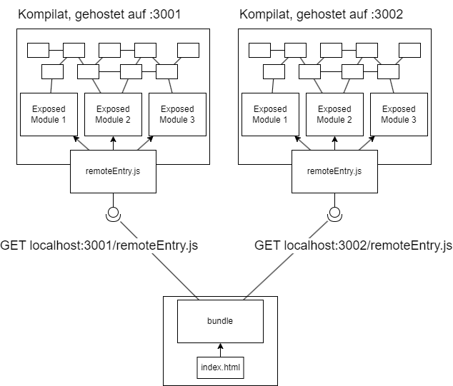

# Microfrontends für Angular und React

//TODO: Intro

## Microfrontends?

Microfrontends? Was genau soll man sich darunter vorstellen?

In der Backend-Welt gibt es das Konzept von "Microservices".
Bei Microservices werden die Funktionalitäten in viele kleine Backends aufgeteilt. Diese Backends können untereinander über bspw. REST oder gRPC kommunizieren, können aber unabhängig von einander Entwickelt und Deployed werden.

Dieser Ansatz verspricht gegenüber dem klassischen Monolithen geringere Komplexität in der Implementation und beim Deployen. // TODO: evtl erweitern

Microfrontends versuchen dieses Konzept in die Frontend-Welt zu übertragen. Die Idee dabei ist es, eine Haupt-Anwendung zu definieren, welche sich Teile des Frontends von anderen Servers lädt und in die Haupt-Anwendung einbindet.

Das hierfür verwendete Konzept nennt sich "Module Federation", welches laut [Webpack Dokumentation](https://webpack.js.org/concepts/module-federation/) eine Anwendung beschreibt, welche aus mehreren Kompilaten besteht bei denen die einzelnen Bundles Funktionalitäten für andere Bundles bereitstellen, bzw. von anderen Bundles konsumieren können.

Dies passiert über eine `remoteEntry.js`, welche von einem remote Module bereitgestellt wird.
  
Die `remoteEntry.js` zeigt einem Konsumenten, wo es im remote Bundle die "öffentlichen" JS-Module finden kann.

### Modulauflösung

Module Federation verwendet standardmäßig ES Module (ESM) für das Laden von externen Modulen. ESM wird [in allen gängigen Browsern unterstützt](https://caniuse.com/?search=ESM) und ist seit einigen Jahren das bevorzugten Modulsystem im Javascript-Ökosystem.

Mit ESM können Module weitere Module über zwei Arten einbinden; über einen top-level Import, sowie über den Aufruf der `import(...)` Funktion:

```ts
import { something } from '../some/module.js';
//      ^- sofort verfügbar

const { somethingElse } = await import('../another/module.js');
//                      ^- der Aufruf ist eine Promise
// es wird gewartet bis das Modul, sowie alle
//  Abhängigkeiten des Moduls, geladen wurden.
```

Module Federation verwendet die `import()` Funktion, um das remote Kompilat zu laden. Denn `import()` kann neben relativen Pfaden (`../module.js`) auch URLs (`http://localhost:3001/module.js`) aufrufen. Diese URLs können auch auf andere Server zeigen, solange der remote Server CORS-Header setzt.

Über `import()` können jedoch die remote Module nicht direkt aufgerufen werden, da Bundler wie Webpack und Rollup (Vite)
TODO

## Frontends

Für diesen Blogeintrag habe ich mir 2 Frontend-Frameworks angeschaut, React und Angular.

Mit den Frameworks wurde jeweils eine kleine Anwendung implementiert, welche das Konzept der Microfrontends erprobt.
Die Anforderung an die Applikationen war es, eine Komponente, bzw. ein Modul von einem anderen Server zu laden und erfolgreich in die Applikation einzubinden, und Daten zwischen den lokalen und "remote" Komponenten zu übertragen.

### React

Das React-Frontend verwendet als Build-Tool _Vite_, ein relativ neues Entwicklungswerkzeug welches viel Wert auf Entwicklererfahrung setzt und bspw. über die Verwendung von ESM und dem Überspringen eines Bundle-Steps erheblich schnellere Bauzeiten (vor allem während der Entwicklung) ermöglicht als es bei bspw. Webpack der fall ist.

Für Vite gibt es das `vite-plugin-federation`-Modul, welches als Plugin in die Vite-Konfiguration eingebunden werden kann.

Über das Plugin lassen sich von diesem Kompilat bereitgestellte, sowie von externen Kompilaten konsumierte JS-Module deklarieren.

```ts
// vite.config.ts
import federation from "@originjs/vite-plugin-federation"

return defineConfig({
  ...
  plugins: [
    ...,
    federation({
      name: "my-component-name",
      // Der Remote Entrypoint. Ein externes Modul kann diese Datei aufrufen
      // und über einen Lookup eine der unter exposes definierten Komponenten
      // laden.
      filename: "remoteEntry.js",
      // Exposes, wenn dieses Modul Komponenten bereitstellt
      exposes: {
        "./SomeComponent": "./src/components/SomeComponent",
        "./AnotherComponent": "./src/components/AnotherComponent",
      },
      // Remotes, wenn dieses Modul externe Komponenten konsumiert,
      // mit einem Link zum Remote-Entrypoint.
      remotes: {
        someRemoteEntry: "http://localhost:5001/assets/remoteEntry.js"
      },
      // Hier definierte Dependencies werden im Browser effektiv
      // nur einmal geladen. Es muss also nicht pro Remote Frontend
      // eine eigene React-Version geladen werden.
      shared: [
        "react", "react-dom"
      ]
    })
  ]
})
```

Bei einem Build sorgt das Plugin dann dafür, dass die `remoteEntry.js`-Datei erzeugt wird.
Die Komponenten können dann über den im `remotes`-Objekt definierten Namen eingebunden werden:

```jsx
const RemoteComponent = React.lazy(() => import('someRemoteEntry/SomeRemoteComponent'));

return (
  <Suspense fallback={<Loading />}>
    <RemoteComponent />
  </Suspense>
);
```

Das Plugin schreibt dann den Import während des Builds so um, dass stattdessen hier die `remoteEntry.js` vom remote Server importiert, und darüber die gewünschte Komponente gefunden wird.

vvv TODO: Schauen, ob das stimmt  
Hier ist wichtig anzumerken, dass ein top-level Import, also

```ts
import RemoteComponent from 'someRemoteEntry/SomeRemoteComponent';
```

nicht möglich ist, da es sich hier um eine synchrone Operation handeln würde. Da das remote Modul zuerst von einem anderen Server geladen werden muss ergibt das wenig Sinn.

Somit muss die `import(...)` Funktion hier verwendet werden. Sie gibt das Modul als Promise zurück.

### Angular

Das Angular-Projekt verwendet _Webpack_ als Build-Tool und das `@angular-architects/module-federation-plugin` Modul zum Aufrufen und Bereitstellen von Remote Modulen.

Ähnlich wie beim `vite-plugin-federation` kann ein Modul über die `webpack.config.js` über `remotes` und `exposes` remote Module konsumieren, bzw. Module für andere remote Module bereitstellen.

```js
module.exports = withModuleFederationPlugin({
  // Wird von diesem Kompilat konsumiert
  remotes: {
    'angular-remote': 'http://localhost:3001/remoteEntry.js',
  },
  name: 'module-name',
  // Liste der JS-Module, welche von diesem Kompilat bereitgestellt werden
  exposes: {
    './ExposedRoute': './packages/angular-remote/src/app/remote-page.module.ts',
  },

  shared: {
    ...shareAll({
      singleton: true,
      strictVersion: true,
      requiredVersion: 'auto',
    }),
  },
});
```

Auch dein Einbinden eines remote Modules ist unter Angular sehr ähnlich zum React+Vite Beispiel:

```ts
const routes: Routes = [
  {
    path: '',
    component: IndexRoute,
    pathMatch: 'full',
  },
  {
    path: 'remoteRoute',
    // Das Remote Modul wird über eine Promise geladen. Dabei handelt
    // es sich um ein Angular-Modul, welches ein
    // RouterModule.forChildren(...) definiert.
    loadChildren: () =>
      loadRemoteModule({
        type: 'module',
        remoteEntry: 'http://localhost:3001/remoteEntry.js',
        exposedModule: './RemoteRoute',
      }).then((m) => m.RemotePageModule),
  },
];

@NgModule({
  imports: [RouterModule.forRoot(routes)],
  exports: [RouterModule],
})
export class AppRoutingModule {}
```

Auch wenn für Angular unüblich, können auch Remote Komponenten über das asynchrone Austauschen einer `ViewContainerRef` auch ohne einen Router eingebunden werden.
// TODO: Ausweiten

## Nachteile und Einschränkungen

Durch Module Federation können Webseiten durch mehrere Build-Fragmente definiert werden. Kommt es zu einer Änderung eines der Fragmente, muss der Rest der Anwendung _nicht_ neu gebaut werden.

Diese Flexibilität hat jedoch auch Einbuße in der Entwicklererfahrung und Typsicherheit.

Solang man nicht die Anwendung mit `any`s beschmückt kann dank Typescript der Kompiler überprüfen, ob die an eine Komponente übergebenen Props mit dem Interface dieser Komponente übereinstimmen. Durch die Verwendung von Module Federation entfällt diese Kopplung.
Der Buildvorgang schlägt somit nicht fehl, wenn die Props nicht korrekt übergeben werden. Es muss somit besonders darauf geachtet werden, dass ein stabiles Interface zwischen den Modulen besteht.

Ein weiterer Schmerzpunkt ist die lokale Entwicklung.
Es ist üblich beim Entwickeln einen lokalen Dev-Server zu starten, welcher bei Änderungen die relevanten Komponenten neu lädt (hot module reload).
Entwickelt man an der Host-Anwendung, so erkennt der Dev-Server keine Änderungen an den eingebundenen Fragmenten.
Entwickelt man an den jeweiligen Fragmenten, dann muss noch zusätzlich ein Wrapper erstellt werden, welcher eine minimale Webseite mit dem jeweiligen Framework bereitstellt, in welchen die Komponente eingebunden wird.

Zuletzt möchte ich noch die Versionierung und Modulauflösung ansprechen. TODO: Ausweiten

## Alternativen

Zu aller erst sollte man sich überlegen, welche Vorteile man sich durch die Microfrontends erhofft.

// 2 Frontends, React und Angular, React mit Vite, Angular mit Webpack

// Alternative Ansätze zu microserv arch
// Nachteile/ Probleme / DX
